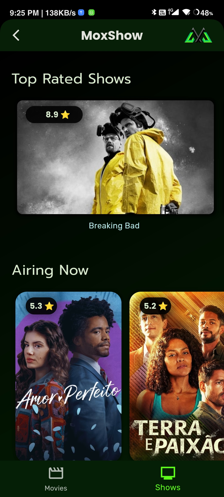

# Moxshow

- [GitHub Repo](https://github.com/bhaveshj2611/MoxShow)

MoxShow is a comprehensive movie and TV shows guide app that aims to bring all the information and insights about cinema right to you.
User can explore a vast variety of genres, from trending movies to top-rated shows, now playing films, and upcoming releases.
From plot summaries and age ratings to release dates and cast descriptions, all these details are displayed on the movie screen.
Powered by the TMDB API, MoxShow delivers personalized recommendations and suggests similar movies based on the currently selected movie.

# Contact me

- [Linkedin](https://linkedin.com/in/bhavesh-joshi-)
- [Gmail](@bhaveshj2611@gmail.com)

Logo Designed using [Canva](https://canva.com)

---

# Start Screen

---
# Home Screen

  

---

# Movie/Show Details Screen

---
# Cast Details Screen

